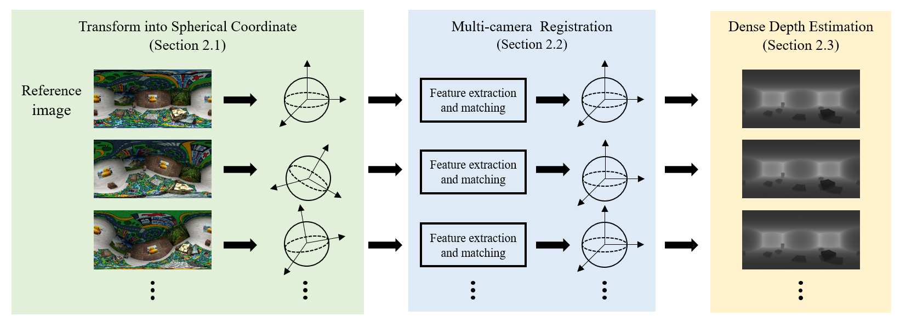
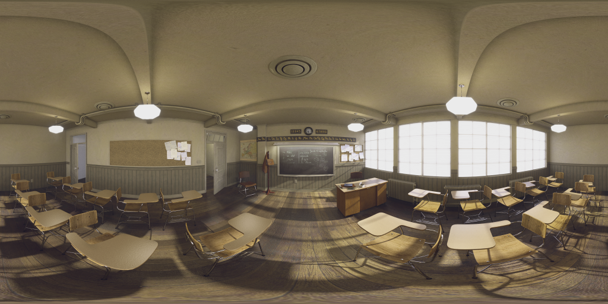
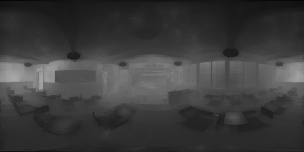

# Dense Depth Estimation from Multiple 360-degree Images Using Virtual Depth
[[Project]](https://vcl.seoultech.ac.kr/vrar.html) [[Paper]](https://link.springer.com/article/10.1007/s10489-022-03391-w) [[arXiv]](https://arxiv.org/abs/2112.14931)

This is the official code of our APIN 2022 paper **"Dense Depth Estimation from Multiple 360-degree Images Using Virtual Depth"**.

## Overview
</center>

## Prerequisites
- Ubuntu 18.04
- C++11 Compiler
- OpenCV > 3.0 (**Tested with OpenCV 3.4.6.**)

## Usage
Clone the repository:
```
git clone https://github.com/ysy9997/360Depth.git
```
You can simply execute `build.sh` to build this program.
```
cd 360Depth
chmod +x build.sh
./build.sh  
```
This will create *libDEMO.so* at *lib* folder and two executable *image* in current folder.  

You can simply run like below.
```
./image [the number of cameras] [max depth] [rigid] [save folder path] [0-th images folder] [1-th images folder] ...
```

If set 'rigid' as 1, it means rotation matrix is identity, and translation vector is [0, 0, -1]. If set 'rigid' as 0, this application will estimate rotation matrix and translation vector. 

The max depth needs to be divided as a baseline between 0-th and 1-th cameras. (e.g. When the baseline is 0.5m and the furthest distance is 10m, then, the max depth should be 20.)

## Results
| Dataset   | *classroom* |            | *smallroom* |            |
|:----------|:-----------:|:----------:|:-----------:|:----------:|
|           |    MSE↓     |   PSNR↑    |    MSE↓     |   PSNR↑    |
| GC-Net    |    0.951    |   20.239   |    5.801    |   12.366   |
| PSMNet    |    4.127    |   13.844   |    7.862    |   11.045   |
| GA-Net    |    2.346    |   16.298   |    4.581    |   13.391   |
| 360SD-Net |    0.218    |   26.625   |    0.581    |   22.361   |
| BiFuse    |    1.803    |   17.481   |    4.108    |   13.866   |
| UniFuse   |    0.215    |   26.707   |    1.655    |   17.825   |
| **ours**  |  **0.193**  | **27.178** |  **0.303**  | **25.193** |


